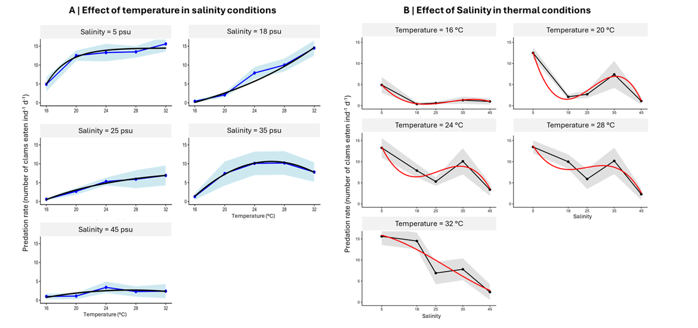
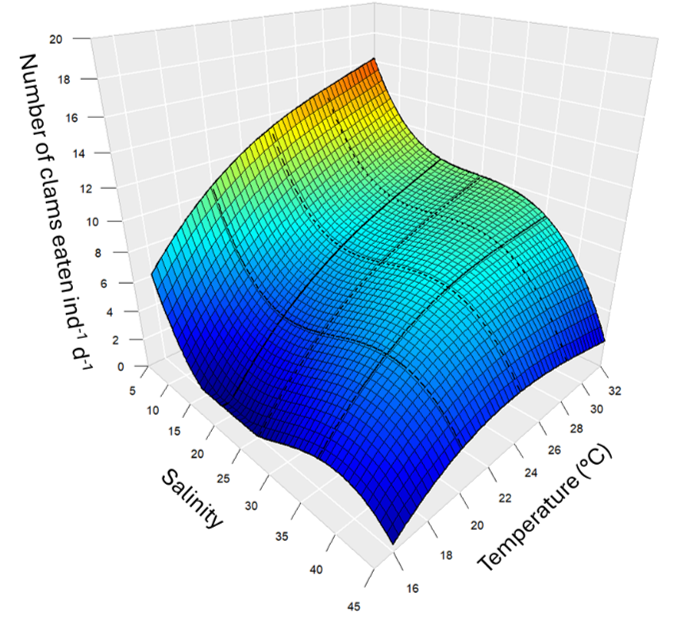
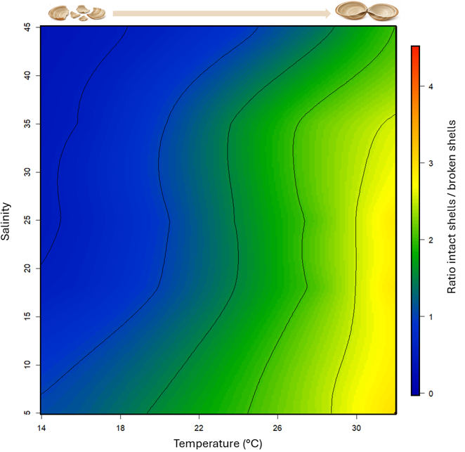
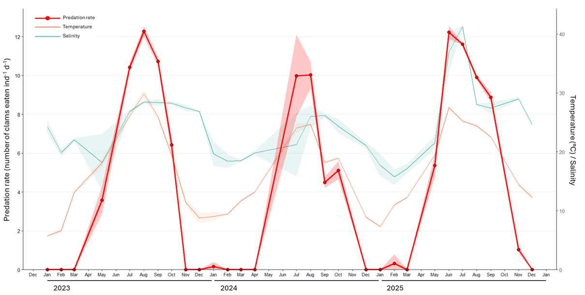
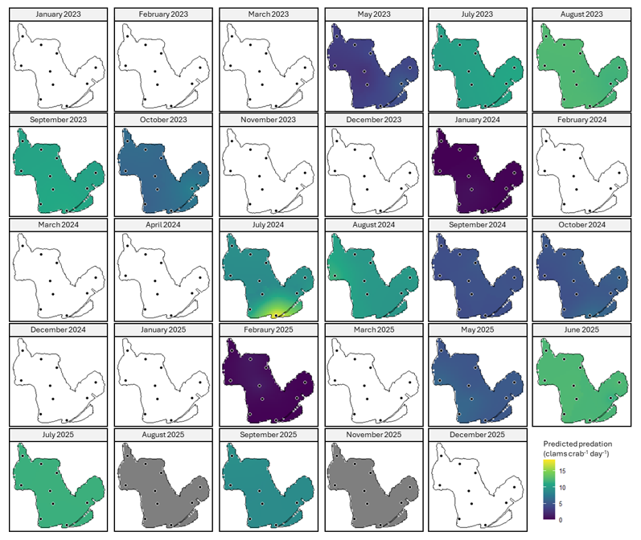

# Journal of Animal Ecology

These R scripts come with the following research article:

\*\*“Temperature and salinity jointly shape predation by the invasive blue crab \*Callinectes sapidus\* in the Berre Lagoon (France)”\*\* (\*Chkili et al., submitted to Journal of Animal Ecology\*).


It includes (i) regression analyses to estimate temperature-dependent predation responses across salinity treatments, (ii) Generalized Additive Models (GAMs) and polynomial models to predict predation rates in three-dimensional environmental space, (iii) kriging procedures to estimate spatial and seasonal predation intensity in the Berre Lagoon, and (iv) niche analyses identifying environmental no-predation conditions.


\---

## Experimental datasets


[Predation number of clams](Sal_Temp_Nb-clams%20-%203D.txt) <br>


[Shell breakage dataset](coquilles.txt) <br>


## Spatial datasets


[Berre Lagoon predation estimation](estimation\_predation\_Berre.txt) <br>


[Berre Lagoon shapefile](couche\_Berre.shp)


## Load required libraries

```R

library(tidyverse)

library(minpack.lm)

library(AICcmodavg)

library(mgcv)

library(plot3D)

library(plotly)

library(readr)

library(dplyr)

library(lubridate)

library(sf)

library(gstat)

library(sp)

library(ggplot2)

library(viridis)

library(fields)

```


\---

## Temperature and salinity effects on predation


In our study, independent regressions were fitted for each salinity treatment to characterize thermal responses of predation and identify threshold effects.


```R
# set working directory
setwd("C:/Users/...")

# import data
data <- read.table("Sal_Temp_Nb-clams - 3D.txt", header = TRUE)

# data cleaning
data <- data %>%
  mutate(
    Temperature = as.numeric(gsub(",", ".", Temperature)),
    Predation = as.numeric(gsub(",", ".", Predation)),
    Salinity = as.factor(Salinity)
  ) %>%
  drop_na() %>%
  filter(Temperature >= 14)

# summary statistics
summary_data <- data %>%
  group_by(Salinity, Temperature) %>%
  summarise(
    n = n(),
    mean = mean(Predation),
    se = sd(Predation) / sqrt(n),
    lower = mean - 1.96 * se,
    upper = mean + 1.96 * se,
    .groups = "drop"
  )

# R² calculation
calc_r2 <- function(model, df) {
  pred <- predict(model, newdata = df)
  1 - sum((df$mean - pred)^2) / sum((df$mean - mean(df$mean))^2)
}

# model fitting depending on salinity
fit_model_by_salinity <- function(df, s) {

  if(s == "5") {

    model <- nlsLM(
      mean ~ A * (1 - exp(-k * (Temperature - Tcrit))),
      data = df
    )

  } else if(s == "18") {

    model <- nlsLM(
      mean ~ y0 + a * exp(b * Temperature),
      data = df %>% filter(Temperature != 24)
    )

  } else if(s == "25") {

    model <- nlsLM(
      mean ~ y0 + a * (1 - exp(-b * Temperature)),
      data = df
    )

  } else if(s %in% c("35", "45")) {

    model <- lm(
      mean ~ Temperature + I(Temperature^2),
      data = df
    )
  }

  list(
    model = model,
    AICc = AICc(model),
    R2 = calc_r2(model, df)
  )
}

# plotting
plots <- list()

for(s in levels(summary_data$Salinity)) {

  df <- summary_data %>% filter(Salinity == s)

  fit <- fit_model_by_salinity(df, s)

  newdata <- data.frame(
    Temperature = seq(16, 32, length.out = 2000)
  )

  newdata$pred <- predict(fit$model, newdata = newdata)

  p <- ggplot(df, aes(x = Temperature, y = mean)) +

    geom_ribbon(
      aes(ymin = lower, ymax = upper),
      fill = "lightblue",
      alpha = 0.6
    ) +

    geom_line(color = "blue", linewidth = 1.2) +
    geom_point(size = 2.6, color = "blue") +

    geom_line(
      data = newdata,
      aes(x = Temperature, y = pred),
      color = "black",
      linewidth = 1.4
    ) +

    labs(
      title = paste("Salinity =", s),
      x = "Temperature (°C)",
      y = "Predation"
    ) +

    coord_cartesian(ylim = c(0, 16)) +

    theme_classic(base_size = 14)

  plots[[s]] <- p
}

# final figure
final_plot <- wrap_plots(plots, ncol = 2)

final_plot
```




Figure 4. Effects of temperature and salinity on the predation activity of the blue crab Callinectes sapidus expressed as the number of clams (Ruditapes philippinarum) consumed per individual per day across (A) thermal conditions for each salinity treatment (5, 18, 25, 35 and 45 psu) and (B) salinity conditions for each temperature treatment (16, 20, 24, 28 and 32 °C). Black lines represent observed mean values, grey areas indicate confidence intervals, and black/red lines correspond to fitted model trends. Predation generally increased with temperature under low to intermediate salinities, whereas high salinity conditions reduced feeding activity, particularly at elevated temperatures. Regression parameters are globalized in the Supplementary Table 1.


\---

## 3-dimensional regression of predation


A GAM model was used to estimate predation intensity as a function of salinity and temperature.


```R

# import data
data <- read.delim(
  "Sal_Temp_pourcentage - 3D.txt",
  header = TRUE,
  sep = "\t",
  dec = ","
)

# data cleaning
data$Salinity <- as.numeric(data$Salinite)
data$Temperature <- as.numeric(data$Temperature)
data$Predation <- as.numeric(data$Predation)

data <- na.omit(data)

# GAM model
mod_gam <- gam(
  Predation ~ s(Salinity, Temperature, k = 10),
  data = data,
  method = "REML"
)

# prediction grid
sal_grid <- seq(
  min(data$Salinity),
  max(data$Salinity),
  length.out = 120
)

temp_grid <- seq(
  min(data$Temperature),
  max(data$Temperature),
  length.out = 120
)

grid <- expand.grid(
  Salinity = sal_grid,
  Temperature = temp_grid
)

# predictions
grid$Predation_pred <- predict(mod_gam, newdata = grid)

grid$Predation_pred[grid$Predation_pred < 0] <- 0
grid$Predation_pred[grid$Predation_pred > 50] <- 50

# matrix conversion
z_matrix <- matrix(
  grid$Predation_pred,
  nrow = length(sal_grid),
  ncol = length(temp_grid)
)

# 3D surface plot
surfaceplot3d <- plot_ly() %>%
  add_surface(
    x = sal_grid,
    y = temp_grid,
    z = t(z_matrix),
    colorscale = "Jet",
    cmin = 0,
    cmax = 50,
    showscale = FALSE
  ) %>%
  layout(
    scene = list(
      xaxis = list(title = "Salinity"),
      yaxis = list(title = "Temperature (°C)"),
      zaxis = list(
        title = "% clam biomass / ind. / day"
      )
    )
  )

surfaceplot3d
```





Figure 5. Three-dimensional predicted response surface showing the combined effects of temperature (°C) and salinity on the number of clams (Ruditapes philippinarum) consumed per individual blue crab (Callinectes sapidus) per day (clams eaten ind⁻¹ d⁻¹). Colors indicate feeding intensity (number of clams eaten ind-1 day-1), ranging from low values (blue) to high values (yellow/orange). The black dotted lines represent the temperatures and salinities experimentally measured in our study.


---


## Ratio of intact to broken shells 


```R

# import data
df <- read_delim(
  "Shell_breakage.txt",
  delim = "\t",
  show_col_types = FALSE
)

# data cleaning
df <- df %>%
  mutate(
    temp = as.numeric(gsub(",", ".", temp)),
    sal  = as.numeric(gsub(",", ".", sal)),
    blue = as.numeric(gsub(",", ".", blue))
  ) %>%
  filter(!is.na(temp), !is.na(sal), !is.na(blue)) %>%
  group_by(temp, sal) %>%
  summarise(
    blue = mean(blue),
    .groups = "drop"
  )

# convert to spatial points
coordinates(df) <- ~ temp + sal

# empirical variogram
vgm_emp <- variogram(
  blue ~ 1,
  df
)

# variogram model fitting
vgm_fit <- fit.variogram(
  vgm_emp,
  vgm(
    psill = var(df$blue),
    model = "Sph",
    range = 8,
    nugget = 0
  )
)

# prediction grid
temp_seq <- seq(14, 32, length.out = 200)
sal_seq  <- seq(5, 45, length.out = 200)

grid_df <- expand.grid(
  temp = temp_seq,
  sal = sal_seq
)

coordinates(grid_df) <- ~ temp + sal
gridded(grid_df) <- TRUE

# kriging interpolation
krig <- krige(
  blue ~ 1,
  locations = df,
  newdata = grid_df,
  model = vgm_fit
)

# predicted values
res <- as.data.frame(krig)

z <- matrix(
  res$var1.pred,
  nrow = length(temp_seq),
  ncol = length(sal_seq)
)

# 2D niche map
image.plot(
  temp_seq,
  sal_seq,
  z,
  xlab = "Temperature (°C)",
  ylab = "Salinity"
)

contour(
  temp_seq,
  sal_seq,
  z,
  add = TRUE
)

points(coordinates(df), pch = 16)
```




Figure 6. Response surface showing the ratio of intact to broken clam shells / broken shells of the clam Ruditapes philippinarum after predation by the blue crab Callinectes sapidus across temperature and salinity gradients. The color scale represents the ratio of intact to broken clam shells / broken shells (the higher the ratio, the fewer broken shells there are), blue = low values; red = high values. 


## Estimating and mapping C. sapidus predation in natural conditions

```R
# import data
df <- read.delim(
  "estimation_predation_Berre.txt",
  header = TRUE,
  sep = "\t",
  dec = ","
)
# data cleaning
df <- df %>%
  mutate(
    lat = as.numeric(gsub(",", ".", Lat)),
    lon = as.numeric(gsub(",", ".", Long)),
    pred = as.numeric(gsub(",", ".", Predation)),
    temp = as.numeric(gsub(",", ".", temp)),
    sal = as.numeric(gsub(",", ".", Sal)),
    date = dmy(date),
    mois = floor_date(date, "month")
  )
# monthly means per station
df_month <- df %>%
  group_by(`nom station`, mois) %>%
  summarise(
    lat = mean(lat),
    lon = mean(lon),
    pred = mean(pred),
    temp = mean(temp),
    sal = mean(sal),
    .groups = "drop"
  )
# monthly evolution
df_evolution <- df_month %>%
  group_by(mois) %>%
  summarise(
    mean_pred = mean(pred),
    mean_temp = mean(temp),
    mean_sal = mean(sal)
  )

ggplot(df_evolution, aes(x = mois)) +
  geom_line(aes(y = mean_pred), color = "red") +
  geom_line(aes(y = mean_temp), color = "orange") +
  geom_line(aes(y = mean_sal), color = "green")
```



Figure 7. Temporal dynamics of the average predation rate of the blue crab Callinectes sapidus in the Berre Lagoon between January 2023 and December 2025. The red curve represents the predation rate, the orange curve the temperature, the light blue the salinity. The areas around the curves represent the confidence interval. 


```R

# lagoon polygon
lagune <- st_read("couche_Berre.shp")

# convert to spatial points
points_sf <- st_as_sf(
  df_month,
  coords = c("lon", "lat"),
  crs = 4326
)

# prediction grid
grille <- st_make_grid(
  lagune,
  cellsize = 400,
  what = "centers"
) %>%
  st_as_sf()

# monthly kriging function
faire_krigeage_mois <- function(points_mois){

  points_sp <- as(points_mois, "Spatial")

  vgm_exp <- variogram(pred ~ 1, points_sp)

  vgm_model <- fit.variogram(
    vgm_exp,
    vgm(model = "Exp")
  )

  krige(
    pred ~ 1,
    locations = points_sp,
    newdata = as(grille, "Spatial"),
    model = vgm_model
  )
}

# apply kriging for each month
liste_krigeages <- lapply(
  unique(points_sf$mois),
  function(m){
    pts <- points_sf %>% filter(mois == m)
    faire_krigeage_mois(pts)
  }
)

krig_all <- do.call(rbind, liste_krigeages)

# final map
ggplot() +
  geom_sf(
    data = st_as_sf(krig_all),
    aes(fill = var1.pred)
  ) +
  geom_sf(data = lagune, fill = NA) +
  geom_sf(data = points_sf) +
  facet_wrap(~ mois) +
  scale_fill_viridis_c()
```



Figure S1. Monthly spatial predictions of *Callinectes sapidus* predation rates on Manila clams in the Berre Lagoon (2023–2025).


\## Contact


\*\*Guillaume Marchessaux\*\*

Institut Méditerranéen d’Océanologie (MIO), Marseille, France

Corresponding author: \[guillaume.marchessaux@ird.fr]


